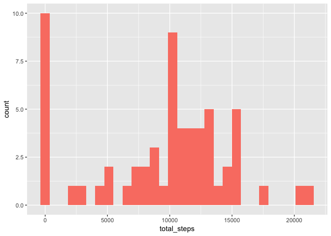
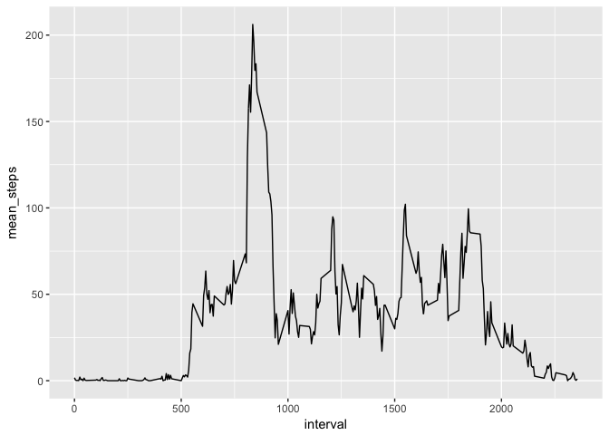
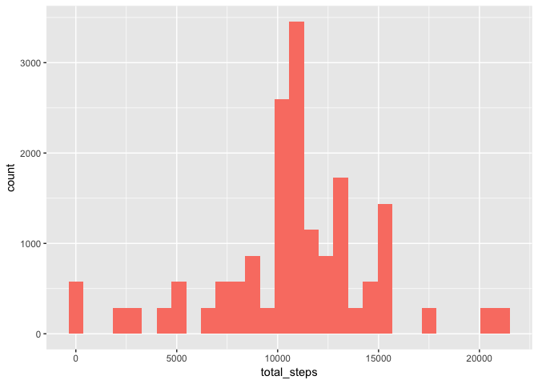
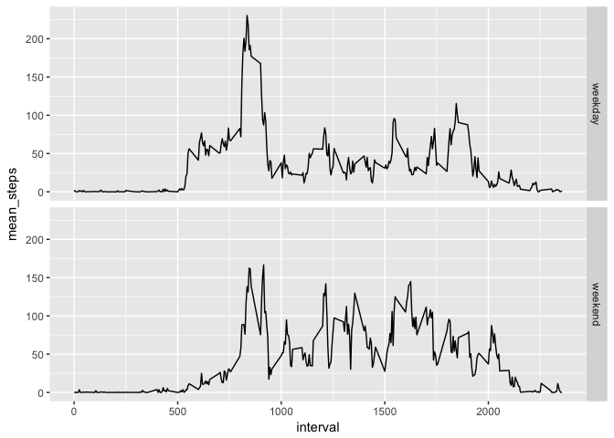

# Reproducible Research: Peer Assessment 1

## Loading and preprocessing the data

Load the data using `read.csv`.


```r
data <- read.csv("activity.csv")
```

Parse the date using `ymd` from the `lubridate` package.


```r
library(lubridate)

data$date <- ymd(data$date)
```

## What is mean total number of steps taken per day?

Make a histogram of the total of steps taken each day. Ignore missing values for this part of the analysis.


```r
library(dplyr)
library(ggplot2)

steps_per_day <- data %>% 
  group_by(date) %>%
  summarize(total_steps = sum(steps, na.rm = TRUE))

steps_per_day %>%
  ggplot(aes(x = total_steps)) + 
  geom_histogram(fill = 'salmon')
```

<!-- -->

Calculate and report the `mean` and `median` total number of steps taken per day (still ignoring missing values).


```r
mean_steps_per_day <- mean(steps_per_day$total_steps, na.rm = TRUE)
median_steps_per_day <- median(steps_per_day$total_steps, na.rm = TRUE)
```

* **Mean**: 9354
* **Median**: 10395

## What is the average daily activity pattern?

Make a time series plot of the 5-minute interval (x-axis) and the average number of steps taken, averaged across all days (y-axis).


```r
activity_pattern <- data %>%
  group_by(interval) %>%
  summarize(mean_steps = mean(steps, na.rm = TRUE)) %>%
  ungroup()

activity_pattern %>%
  ggplot(aes(x = interval, y = mean_steps)) +
  geom_line()
```

<!-- -->

Which 5-minute interval, on average across all the days in the dataset, contains the maximum number of steps?


```r
max_row <- which.max(activity_pattern$mean_steps)
max_interval <- activity_pattern$interval[max_row]
```
The 5 minute interval which contains the maximum number of steps averaged across all the days is 835,
which corresponds to 8:35 - 8:40 am.

## Imputing missing values

Calculate and report the total number of missing values in the dataset (i.e. the total number of rows with NAs).


```r
total_missing <- sum(is.na(data$steps))
```

There are a total of 2304 rows with missing values for steps.

Replace the missing values with the mean for that 5-minute interval. Create a new dataset that is equal to the original dataset but with the missing data filled in. (I created a new column `steps_imputed` instead of overwriting the `steps` column so that I could check that my imputation worked the way I wanted.)


```r
data_imputed <- data %>%
  group_by(interval) %>%
  mutate(steps_imputed = ifelse(is.na(steps), mean(steps, na.rm = TRUE), steps)) %>%
  ungroup()
```

Make a histogram of the total number of steps taken each day, using the new data set with missing values imputed.


```r
steps_per_day_imputed <- data_imputed %>%
  group_by(date) %>%
  mutate(total_steps = sum(steps_imputed))
  
steps_per_day_imputed %>%
  ggplot(aes(x = total_steps)) +
  geom_histogram(fill = 'salmon')
```

<!-- -->

Calculate and report the mean and median total number of steps taken per day. Do these values differ from the estimates from the first part of the assignment? What is the impact of imputing missing data on the estimates of the total daily number of steps?


```r
mean_imputed <- mean(steps_per_day_imputed$total_steps)
median_imputed <- median(steps_per_day_imputed$total_steps)
```

The new mean and median, after imputing the missing values, are:

* **Mean:** 10766
* **Median:** 10766

We see that the sharp peak in the distribution at 0 in the first histogram was due to the missing values. After setting the missing values equal to the mean steps in the corresponding interval, the new histogram shows that imputation fills out the middle of the distribution and decreases the count in the 0-5 interval.

The mean and median match now, because we no longer have missing values skewing the data.

## Are there differences in activity patterns between weekdays and weekends?

Create a new factor variable in the dataset with two levels -- "weekday" and "weekend" indicating whether a given date is a weekday or weekend day.

I used the `wday()` function from the `lubridate` package to identify the weekdays. When applied to a date, this function returns 7 if the date is a Saturday and 1 if the date is a Sunday. 
I used `mutate` from the `dplyr` package to add the new factor column, assigning "weekend" if the output of `wday()` is 1 or 7 (corresopnding to the weekend days), and "weekday" else.


```r
library(dplyr)
library(lubridate)

data_imputed <- data_imputed %>%
  mutate(weekday = ifelse(wday(date) %in% c(1, 7), "weekend", "weekday"))

data_imputed$weekday <- factor(data_imputed$weekday)
```

Make a panel plot containing a time series plot of the 5-minute interval (x-axis) and the average number of steps taken, averaged across all weekday days or weekend days (y-axis). 


```r
summary <- data_imputed %>%
  group_by(interval, weekday) %>%
  summarize(mean_steps = mean(steps_imputed))

summary %>%
  ggplot(aes(x = interval, y = mean_steps)) +
  geom_line() +
  facet_grid(weekday ~ .)
```

<!-- -->

There is a clear difference in activity patterns between weekends and weekdays, particularly in the morning from about 5 - 9 am. On weekdays, there is an elevated activity level from about 5:30 to 7 that is not present on weekends. On both weekends and weekdays, activity peaks around 8:30 am, but the activity level at this peak time is higher on weekdays than on weekends.
